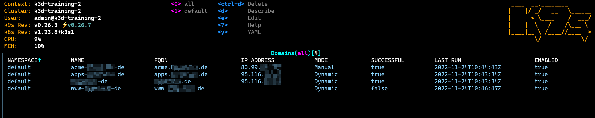

# Strato DynDNS Controller for Kubernetes
Strato DynDNS Controller updates your domains' DNS records on STRATO AG using Kubernetes Custom Resources and Controller



## Disclaimer
THIS SOFTWARE IS NO WAY ASSOCIATED OR AFFILIATED WITH [STRATO AG](https://www.strato.de)

## Description
A custom Controller is observing Domain CRs and syncing their desired state with STRATO DNS servers. You can either define explicitely an IPv4 address (Manual mode) or let the Controller discover you public IPv4 assigned to you by your ISP (Dynamic mode) 

## Getting Started
You’ll need a Kubernetes cluster to run against. You can use [KIND](https://sigs.k8s.io/kind) or [K3D](https://k3d.io/v5.4.6/) to get a local cluster for testing, or run against a remote cluster.
**Note:** Your controller will automatically use the current context in your kubeconfig file (i.e. whatever cluster `kubectl cluster-info` shows).

### Running on the cluster
1. Install Instances of Custom Resources:

Encode your STRATO DynDNS password for your domain or your STRATO DynDNS master password:

```sh

echo -n "password" | base64

```

Create a Secret containing the base64 encoded password for your Domain:

```
apiVersion: v1
kind: Secret
metadata:
  name: strato-dyndns-password
type: Opaque
data:
  password: cGFzc3dvcmQ=
```

Create a Domain pointing to the FQDN of your domain registered with STRATO and bind it with the Secret containing the password for this DynDNS account:

```
apiVersion: dyndns.contrib.strato.com/v1alpha1
kind: Domain
metadata:
  name: www-example-de
spec:
  fqdn: "www.example.de"
  enabled: true
  interval: 5
  password:
    name: strato-dyndns-password
```

Deploy these resources to your Kubernetes cluster:

```sh
kubectl apply -f config/samples/
```

2. Build and push your image to the location specified by `IMG`:
	
```sh
make docker-build docker-push IMG=<some-registry>/strato-dyndns:tag
```
	
3. Deploy the controller to the cluster with the image specified by `IMG`:

```sh
make deploy IMG=<some-registry>/strato-dyndns:tag
```

### Uninstall CRDs
To delete the CRDs from the cluster:

```sh
make uninstall
```

### Undeploy controller
UnDeploy the controller to the cluster:

```sh
make undeploy
```

## Contributing
Please refer to our [Contributing Guidelines](CONTRIBUTING.md)

### How it works
This project aims to follow the Kubernetes [Operator pattern](https://kubernetes.io/docs/concepts/extend-kubernetes/operator/)

It uses [Controllers](https://kubernetes.io/docs/concepts/architecture/controller/) 
which provides a reconcile function responsible for synchronizing resources untile the desired state is reached on the cluster 

### Test It Out
1. Install the CRDs into the cluster:

```sh
make install
```

2. Run your controller (this will run in the foreground, so switch to a new terminal if you want to leave it running):

```sh
make run
```

**NOTE:** You can also run this in one step by running: `make install run`

### Modifying the API definitions
If you are editing the API definitions, generate the manifests such as CRs or CRDs using:

```sh
make manifests
```

**NOTE:** Run `make --help` for more information on all potential `make` targets

More information can be found via the [Kubebuilder Documentation](https://book.kubebuilder.io/introduction.html)

